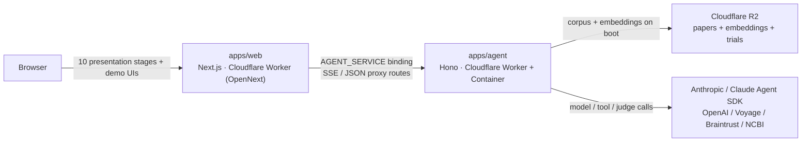

# Architecture

NovaMind Agent Demo is split into a presentation UI, an agent service, and
shared packages. The same `@novamind/pipeline` primitives drive both the
live SSE demo and the offline eval harness, so the demo and reusable package
stay aligned on orchestrator, tool, and eval behavior.

## Runtime Topology

## Packages

- `apps/web` — Next.js 15 App Router. Renders the 10 presentation stages
  plus the three demo surfaces. API routes (`/api/agent/startup`,
  `/api/agent/status`, `/api/stream`, `/api/data-viz/run`, `/api/eval/run`,
  `/api/eval/improve`) proxy JSON / SSE to the agent.
  The live demos cache their latest completed browser run in versioned
  `localStorage`: Stage 5 writes the research-agent run, Stage 6 consumes that
  handoff before enabling visualization generation, and Stage 8 preserves
  hill-climb history while the presenter navigates.
- `apps/agent` — Hono service deployed as a Cloudflare Worker (in
  `worker.ts`) that owns a Cloudflare Container running the Node server
  (`server.ts`). Routes: `/health`, `/runtime/startup`, `/runtime/status`,
  `/literature/stream`, `/data-viz/run`, `/eval/run`, `/improve-prompt`.
- `packages/pipeline` — Owns retrieval (BM25 + Voyage / OpenAI vector +
  reciprocal-rank-fusion hybrid), the literature orchestrator and typed
  retrieval/model tools, the ClinicalTrials.gov report-builder agent, the
  prompt-improver (Sonnet 4.6), and the provider-agnostic `callStructured()`
  adapter.
- `packages/eval` — Imports `@novamind/pipeline` to run four evaluation
  axes both as CLI scripts and as a streaming SSE endpoint. Exports
  factory functions (`buildPlanStabilitySpec` etc.) so the live harness
  can A/B prompts against the same dataset.
- `packages/corpus` — Build-time scripts: PubMed E-utilities ingestion,
  ClinicalTrials.gov API v2 snapshot ingest, Voyage + OpenAI embedding,
  R2 upload via Wrangler or S3 keys.
- `packages/shared` — Zod request schemas, the SSE event protocol (`StreamEvent`,
  `DataVizStreamEvent`, `EvalStreamEvent`), shared usage helpers
  (`ZERO_USAGE`, `sumUsage`, `addUsage`), access helpers, and the canonical
  hypothesis system prompt.

## Extension Boundaries

The repo is designed to be cloned and adapted without rewriting the whole
stack. Keep these boundaries in place unless you are intentionally changing
the product contract:

- Domain data changes belong in `packages/corpus` and the loaders under
  `packages/pipeline/src/rag` or `packages/pipeline/src/data-viz`.
- Browser-visible request and stream contracts belong in `packages/shared`;
  web and agent routes should validate against those shared schemas.
- Provider keys, model calls, retrieval, eval execution, and Agent SDK runtime
  state stay on the agent side. Browser code renders typed events and sends
  validated requests.
- Agent SDK orchestration is for multi-tool trajectories. Bounded extraction,
  verification, judging, prompt improvement, and final synthesis use direct
  structured model calls through `callStructured()`.
- Public docs should describe current behavior and supported extension points,
  not local setup history or private iteration notes.

## Streaming Contract

The agent emits server-sent events for the live demos. Event schemas live in
`@novamind/shared` and define the canonical stream contracts:

- `StreamEvent` — literature research agent (`literature_stage_started`,
  `tool_call`, `tool_result`, `literature_stage_finished`,
  `pipeline_result`, `error`).
- `DataVizStreamEvent` — ClinicalTrials.gov data-viz demo
  (`data_viz_started`, `data_viz_step`, `data_viz_chart`,
  `data_viz_complete`, `data_viz_error`).
- `EvalStreamEvent` — eval harness (`eval_started`, `eval_case_started`,
  `eval_case_complete`, `eval_complete`, `eval_error`).

Request bodies are Zod-validated at the web and agent service boundaries.
Stream events are produced from typed server code and parsed in the browser
with lightweight runtime guards derived from the same contract shape. That
keeps React components decoupled from agent internals while avoiding a full
Zod validator in browser chunks.

Browser stream consumers use the shared SSE reader and an abort-controller
lifecycle helper. Resetting a demo, replacing a run, or navigating away aborts
the browser request; web API routes forward the same cancellation signal to
the agent proxy so upstream Agent SDK and structured model work can stop
promptly.

The web proxy and agent SSE adapter also send comment heartbeats during long
backend model turns. Those comments are not part of the typed event contract;
they keep the Cloudflare proxy and browser connection active until the next
JSON event lands.
Internal producer-to-SSE queues are bounded so a stalled browser consumer
cannot grow memory without limit; hitting that guard fails the stream loudly
instead of silently buffering unbounded events.

## Retrieval Path

At boot the agent initializes RAG via `preloadRagResources()`, which loads
`papers.json`, builds BM25, and preloads the Voyage embedding index. When an
authorized presenter loads the web app, `AccessGateProvider` calls
`/api/agent/startup`. That web route starts the agent container through the
Cloudflare service binding, repeats the idempotent literature preload, and
runs a one-hit retrieval probe for the seeded HbA1c GLP-1 demo query so the
vector path and query embedding cache are ready before the live "Run agent"
click. The startup route also preloads the ClinicalTrials.gov dataset used by
Stage 6. While the deck remains open, the browser sends a lightweight
probe-free startup ping every 10 minutes to keep the same backend runtime
active.

The startup route launches RAG preload, trial-data preload, and Agent SDK
warm-profile startup together. The runtime manager still serializes Agent SDK
profile startup internally, so resource I/O can overlap without spawning
concurrent SDK sessions in the same profile/runtime.

Before the agent Worker proxies traffic into the container, it verifies that
the running container was started by the current Worker version. The Worker
passes Cloudflare version metadata into the container at start time; `/health`
echoes that runtime identity. If a named Durable Object still has an older
container process alive, the Worker destroys it once, starts a fresh process,
and only then forwards the demo request. This keeps long `sleepAfter`
windows useful for demos without allowing stale container images to serve a
new Worker route surface.

The default data resolution order is:

1. **Cloudflare R2** — when `NOVAMIND_PAPERS_URL` (and corresponding
   embedding URLs) are set. The production path.
2. **Local filesystem** — `internal/corpus/data/` plus the
   `NOVAMIND_CORPUS_DIR` override. The local development path.
3. **Offline 12-paper fixture** — `packages/pipeline/src/rag/fixtures.json`.
   Offline fallback for local development, or an explicit demo path when
   `DEMO_FIXTURE_MODE=true`.

Production fails closed before fixture fallback unless
`DEMO_FIXTURE_MODE=true` is set explicitly. This prevents a misconfigured
deployment from silently demoing against sample data.

The current deployed corpus is small enough to load into memory. For a
larger deployment, swap `vector.ts` for Cloudflare Vectorize (or any
managed vector store) and `bm25.ts` for D1 FTS5 — the boundaries in
`packages/pipeline/src/rag` are designed to make that local change.

## Agent SDK Runtime Startup

The demo uses two top-level Claude Agent SDK profiles:

- `literature` — the Stage 5 research orchestrator and its four literature
  MCP tools.
- `data-viz` — the Stage 6 report-builder and its handoff, dataset profile,
  and chart-building MCP tools.

Each profile is configured with the same `Options` it will use for the live
run, then prestarted with Agent SDK `startup()`. The returned `WarmQuery` is
one-shot, so `packages/pipeline/src/agent-sdk/runtime.ts` owns the lifecycle:
single-flight startup, backend-local status, one live claim, cleanup, and
automatic replenishment after each claimed run. Multiple browser reloads or
startup pings converge on the same in-container runtime manager; they do not
create independent browser-owned Agent SDK processes.

The startup manager sequences profile startup in one container. If a live run
arrives while its profile is still starting, the run waits for a short bounded
window. If the profile is not ready by then, the manager aborts that warm
startup and the live route falls back to a cold `query()` with the same
options. Replenishment after a claimed run uses the same startup queue, so
background warm-profile creation remains serialized. Live work always has
priority over background startup for the profile it needs.

The profiles use separate isolated runtime and config directories under
`/tmp/novamind-claude-agent-sdk/<profile>` unless explicit overrides are set.
This keeps Claude Code local settings, memory, and session artifacts out of
the production path and avoids cross-profile writes inside the same
container. The app remains the deterministic supervisor for the Stage 5 to
Stage 6 handoff: the research agent produces typed application state, the UI
asks for presenter confirmation on the next slide, and the data-viz profile
consumes that handoff when generation starts.

## Clinical Trial Data Path

Stage 6 is built from official ClinicalTrials.gov API v2 records with posted
results. It also consumes the latest Stage 5 research handoff from browser
storage, passing the research question, synthesized hypothesis, verified
evidence, and confidence into the report-builder agent.
`pnpm --filter @novamind/corpus clinical-trials --retmax=250` writes
`internal/clinical-trials/data/clinical-trials.json`; `upload-r2` uploads it
beside the PubMed corpus and prints `NOVAMIND_TRIALS_URL`.

At runtime `packages/pipeline/src/data-viz/loader.ts` resolves the trial
dataset in this order:

1. **Cloudflare R2** — `NOVAMIND_TRIALS_URL`.
2. **Local filesystem** — `internal/clinical-trials/data/`, or
   `NOVAMIND_TRIALS_DIR`.
3. **Offline fixture** — only as an offline fallback, or when
   `DEMO_FIXTURE_MODE=true`.

Like the literature corpus, production fails closed if the R2/local trial
snapshot is unavailable and fixture mode was not explicitly enabled.

The model does not invent chart numbers. A Claude Agent SDK report-builder
uses the main SDK loop with a static profile prompt, receives the research
handoff in the run prompt, profiles the available trial rows, and calls a scoped
`build_trial_chart` tool four times. That tool owns filtering and aggregation
over normalized study, outcome, and adverse-event rows, then streams each
completed chart to the browser. The query owns the final recommendation
contract through the SDK's JSON-schema `outputFormat`; the app emits
`data_viz_complete` after that structured output validates. If all four charts
are already built and the final SDK turn stalls or returns invalid structured
output, the app emits the same terminal event from a deterministic report
assembled from the completed chart set.

## Model Path

The literature orchestrator uses `@anthropic-ai/claude-agent-sdk` through
`packages/pipeline/src/literature/orchestrator.ts`. Narrow structured Claude
calls use the Anthropic Messages API through
`packages/pipeline/src/structured.ts`, with Zod schemas converted to provider
JSON schema. Claude direct calls use Messages API JSON structured outputs
(`output_config.format`) and then validate the returned JSON with the original
Zod schema. The shared adapter records finish reason, sent effort, schema
name, and normalized usage; caller budgets are enforced as post-response
guards because the direct Messages API does not pre-authorize per-call spend.
Agent SDK top-level costs come from the SDK result telemetry. Direct API
costs are rate-card estimates from `DIRECT_API_PRICING`, a date-stamped
catalog with official pricing source links and strict model matching.
For Claude structured-output calls, unsupported JSON-schema constraints are
copied into field descriptions before the schema is sent, while the original
Zod schema remains the local validator. If Claude hits `stop_reason:
"max_tokens"` before producing valid structured output, the adapter retries
once with a larger output-token budget and reports `retryCount` plus the
initial finish reason in metadata. If the final provider response is still
token-capped, metadata also marks the call as truncated.
That keeps one-shot calls fast and schema-shaped without paying Agent
SDK/tool-loop overhead. OpenAI remains available for provider-comparison eval
axes.
Voyage handles document and query embeddings.

This section summarizes the runtime path. For the detailed Claude standards
for Agent SDK configuration, Messages API structured outputs, prompt/schema
responsibilities, effort selection, context shaping, and error handling, see
[Claude integration](claude.md).

Use this split when extending the repo:

- Use the Claude Agent SDK when the model needs to coordinate multiple tools,
  recover from typed tool errors, or produce a multi-step trajectory.
- Use `callStructured()` for narrow extraction, judging, prompt improvement,
  and final one-shot transformations. Pass an explicit effort value for
  Claude models that support it; do not rely on model defaults for
  latency-sensitive demos. Haiku calls intentionally omit effort because
  Haiku does not support the effort parameter.
- Keep the application Zod parse even when the provider promises structured
  output. Provider constraints keep generation on schema; local validation
  keeps API boundaries and tests honest.
- Keep prompt instructions semantic. The schema owns JSON shape; prompts
  should explain role, inputs, evidence boundaries, scoring rubrics, and field
  meaning instead of restating JSON syntax.
- Use prompt caching only where the stable prefix is large enough and reused
  across calls. The literature model tools cache the retrieved-paper block with
  a 1-hour TTL and keep task-specific claim/verifier instructions after that
  breakpoint so the paper prefix can be reused. The hill-climber prompt changes
  between runs, so effort control and context pruning are higher-leverage than
  caching there.

The Stage 5 literature demo uses one real Claude Agent SDK orchestrator with
scoped typed tools. It runs in SDK isolation mode for this bounded route:
filesystem settings and skills are disabled, Agent SDK memory auto-loading is
off, tool search is disabled, extended thinking is disabled by default, and
the Agent SDK subprocess uses an isolated runtime directory instead of user
Claude config. The orchestrator runs Sonnet 4.6 at low effort unless
`NOVAMIND_ORCHESTRATOR_EFFORT` is set to a supported value (`medium`, `high`,
or `max` for Sonnet 4.6; `xhigh` only on models that support it). Unsupported
effort settings fall back to `low`.
The browser SSE lifecycle owns an `AbortController`; if the client
disconnects, the Agent SDK query and direct structured model calls are
cancelled together. The orchestrator emits
product-safe `agent_loop_event` updates for session/model/tool/complete
milestones. Those progress events carry backend-owned labels, including the
terminal structured-output finalization state, so browser clients do not infer
agent state from the current literature stage. The pipeline also emits
structured timing logs at each orchestrator/tool boundary
(`search_literature`, `rag_retrieve`,
`extract_candidate_claims`, `verify_citations`, `synthesize_hypothesis`) and
for each Agent SDK message-loop event (`orchestrator_sdk`) so Cloudflare logs
can separate container startup, SDK/model turn latency, retrieval, structured
model calls, and final synthesis latency. The web Worker also mirrors
upstream SSE event metadata as `stream_passthrough_event`, which preserves
run-level observability even when platform-delivered Container stdout is
delayed or incomplete:

1. Claude Sonnet 4.6 orchestrator calls the research tools in a bounded order
   and retries recoverable validation failures with the tool-provided hint.
2. The orchestrator supplies one compact biomedical query to the
   `search_literature` tool; TypeScript runs hybrid RAG retrieval over the
   preloaded corpus with no extra model call. Tools return MCP
   `structuredContent` plus a concise text summary so Claude receives typed
   status, data, and retry hints without parsing JSON prose.
3. Claude Haiku 4.5 extracts one candidate claim per retrieved abstract.
4. The claim-extraction tool wrapper validates the schema, appends the demo
   verifier-check claim only when enabled, and attaches stable evidence IDs.
5. Claude Haiku 4.5 verifies all claims against their paired abstracts in one
   structured call; TypeScript emits per-claim verifier UI events from the
   structured verdicts.
6. Claude Opus 4.7 receives verified and rejected claim sets and returns a
   hypothesis plus selected verified evidence IDs.
7. TypeScript assembles the final evidence list from supported verifier
   verdicts only; rejected or unknown IDs are dropped before the
   `pipeline_result` event.
8. The top-level Agent SDK result validates a minimal completion/failure
   contract. TypeScript emits a deterministic completion note from run counts,
   then streams the `pipeline_result` application payload.

The Agent SDK configuration is intentionally explicit:

- `startup()` is used for authenticated demo runtime startup. Warm profiles
  are configured with the same `Options` as live runs because the `WarmQuery`
  handle accepts the prompt later but does not accept new options.
- Warm profiles are single-flight and one-shot. The runtime manager never
  launches concurrent startup sessions for the same profile, sequences
  background profile startup, and replenishes a profile after a claimed run.
- Live SSE routes use first-message and idle-message timeouts around the SDK
  stream. A startup wedge therefore becomes a clear timed error instead of an
  endless "starting" state.
- `tools: []` removes built-in Claude Code tools from the main thread.
- `allowedTools` lists only the route-specific MCP tool names the orchestrator may call.
  This is a permission allowlist; tool availability is also constrained by the
  in-process MCP server registration.
- `permissionMode: "dontAsk"` prevents interactive permission prompts in the
  server route. Any unapproved tool request is denied instead of pausing the
  stream.
- `strictMcpConfig: true` fails fast if the MCP server or tool registration is
  malformed.
- `settingSources: []`, `skills: []`, `CLAUDE_CODE_DISABLE_AUTO_MEMORY=1`, and
  profile-specific isolated `CLAUDE_CONFIG_DIR` values keep user/project
  Claude settings, memory, and skills out of this bounded production path.
- `ENABLE_TOOL_SEARCH=false` is deliberate. Tool search is useful for large
  catalogs; this demo has four known tools that should always be visible.
- Tool results return MCP `structuredContent`. Non-OK envelopes also set
  `isError:true`, which lets Claude treat recoverable validation failures as
  failed tool calls while still reading the typed `retryHint`.
- Agent SDK terminal answers always use structured outputs. The literature
  orchestrator's terminal schema is a minimal completion/failure contract
  because its typed synthesis tool owns the hypothesis payload. The
  report-builder uses a success-only schema for `recommendation`, `rationale`,
  and `caveats`; failures stay on the stream as errors instead of asking the
  model to choose a separate failed result shape.
- The literature tools do not declare `readOnlyHint` even when they read data,
  because each handler also mutates the in-memory run state and emits user
  visible progress events.

The intentional demo-only input is enabled by the agent runtime's
`INJECT_UNVERIFIED_CLAIM` environment variable. The extractor model still
returns only abstract-derived claims; when `INJECT_UNVERIFIED_CLAIM=true`, the
extraction tool wrapper appends one unsupported verifier-check claim afterward
and emits a UI-only stream message so the audience can see the demo setup.
Demo metadata is not included in the Agent SDK orchestrator prompt, tool
`structuredContent`, verifier prompt, or hypothesis prompt. Evals pass
`injectUnverifiedClaim:false` so scoring uses only claims extracted from
retrieved abstracts.

In Linux containers, the agent package explicitly resolves the SDK-bundled
native Claude Code binary, preferring the glibc package on Debian-based
images. Set `NOVAMIND_CLAUDE_EXECUTABLE_PATH` only if your image's
auto-resolved binary cannot run.

For production timing analysis, see [Production observability](observability.md).

## Web-To-Agent Networking

In production, `apps/web` reaches the agent through the `AGENT_SERVICE`
Cloudflare service binding declared in `apps/web/wrangler.toml`. In local
dev, `lib/agent-endpoint.ts` falls back to public `fetch()` against
`AGENT_BASE_URL` only when `NOVAMIND_ALLOW_LOCAL_AUTH=1` is set; outside that
explicit local mode, a missing service binding fails closed.

The web Worker forwards the verified Access email with an HMAC signature over
the request method, path, run id, timestamp, and email. The agent Worker
verifies direct internal smoke requests at the edge, then forwards a fresh
signed identity into the container. The container validates the same signature
shape with `NOVAMIND_AGENT_INTERNAL_TOKEN`; direct public agent requests
without internal identity must carry a Cloudflare Access JWT that verifies
against `CLOUDFLARE_ACCESS_TEAM_DOMAIN` and `CLOUDFLARE_ACCESS_AUD`.

Do not replace the binding with public Worker-to-Worker `fetch()`.
Cloudflare blocks same-zone public Worker-to-Worker traffic in common
configurations and the binding avoids the issue while staying free.
